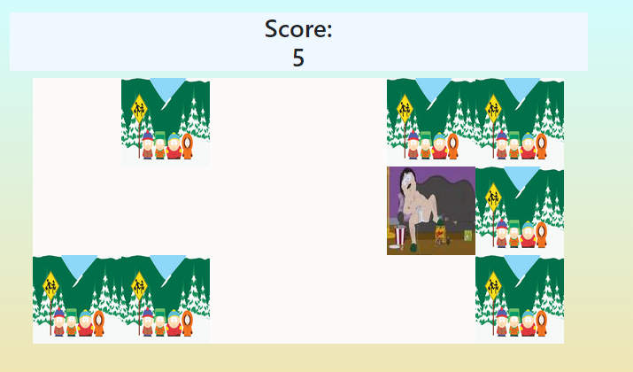

# JavaScript-GAMES(https://java-script-games.herokuapp.com/)
> Games made with JavaScript. Each game will be more advanced than the previous one.

## Table of contents
* [General info](#general-info)
* [Screenshots](#screenshots)
* [Technologies](#technologies)
* [Setup](#setup)
* [Features](#features)
* [Contact](#contact)

## General info
  The project aims to learn JavaScript. An important part of the project will be game tests and preventing player from cheating

## Screenshots

## Technologies
* JavaScript - ES8
* Python - version 3.8.1
* Django - version 3.05
* bootstrap - version 4.4.1
* jquery - version 3.4.1
* HTML5/CSS

## Setup
1. Deploy on Heroku, everything is setup

## Features
List of features:
* connects django static files with JavaScript

## Contact
Created by <b>Marek Chałabis</b> email: chalabismarek@gmail.com
