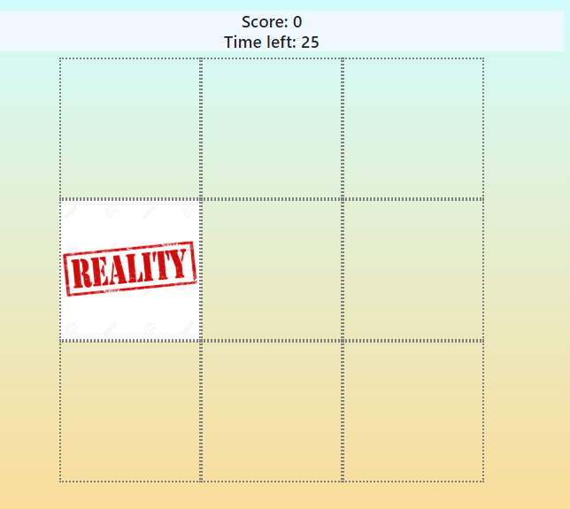
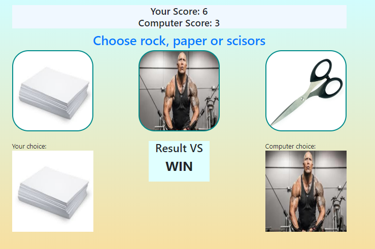

# JavaScript-GAMES(https://java-script-games.herokuapp.com/)
> Games made with JavaScript. Each game will be more advanced than the previous one.


## Table of contents
* [General info](#general-info)
* [Screenshots](#screenshots)
* [Technologies](#technologies)
* [Setup](#setup)
* [Contact](#contact)

## General info
  The project aims to learn JavaScript. An important part of the project will be game tests and preventing player from cheating
  
  JS code:
  * [Connect 4](games/static/games/js/connect_4.js)
  * [Rock paper scissors](games/static/games/js/rock_paper_scissors.js)
  * [South Park - memory game](games/static/games/js/south_park.js)
  * [Whack your nightmare](games/static/games/js/whack_your_nightmare.js)
  
## Screenshots





## Technologies
* JavaScript - ES8
* Python - version 3.8.1
* Django - version 3.05
* bootstrap - version 4.4.1
* jquery - version 3.4.1
* HTML5/CSS

## Setup
1. Install Python
2. Install packages
```
    pip install -r requirements.txt
```
3, Run
```
    python3 manage.py runserver
```

## Contact
Created by <b>Marek Chałabis</b> email: chalabismarek@gmail.com
